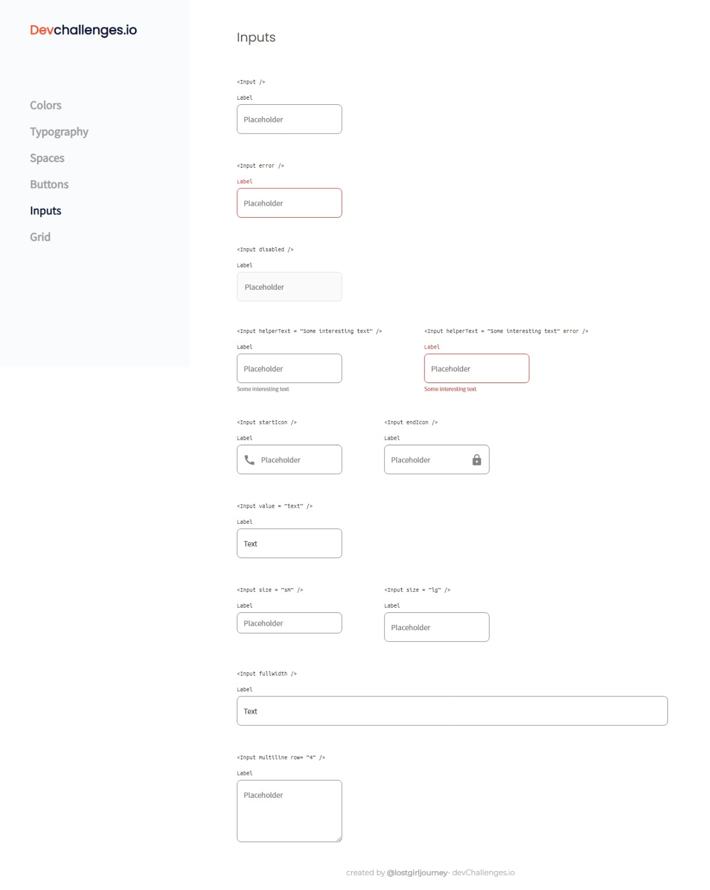
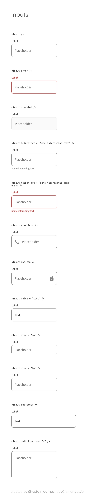

<h1 align="center">Input Component</h1>

   Solution for a challenge from  <a href="http://devchallenges.io" target="_blank">Devchallenges.io</a>.

  <h3>
    <a href="https://input-component-page-solution.vercel.app/">
      Demo
    </a>
     | 
    <a href="https://devchallenges.io/solutions/PqzAyZt9eCXo6VqQaLCK">
      Solution
    </a>
     | 
    <a href="https://devchallenges.io/challenges/TSqutYM4c5WtluM7QzGp#">
      Challenge
    </a>
  </h3>

## Table of Contents

-   [Overview](#overview)
    -   [Built With](#built-with)
-   [Features](#features)
-   [Contact](#contact)

## Overview

|            Laptop View            |               Mobile View                |
| :-------------------------------: | :--------------------------------------: |
|  |  |

Challenge was to create diiferent **_input components_** following the design given on the website.

### Built With

  <ul>
    <li>
      <a href="https://reactjs.org/">
        React
      </a>
      
    </li>
  </ul>

## Features

This application/site was created as a submission to a [DevChallenges](https://devchallenges.io/challenges) challenge. The [challenge](https://devchallenges.io/challenges/TSqutYM4c5WtluM7QzGp) was to build an application to complete the given user stories.

## Contact

-   GitHub: [@lostgirljourney](https://github.com/lostgirljourney)
-   Twitter: [@melophilecoder](https://twitter.com/melophilecoder)
